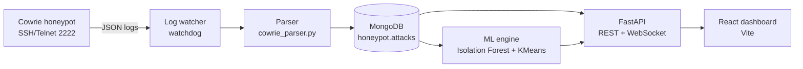

# test paste
second line# CDHAS — Cyber Deception & Honeypot Analytics System


A SOC-style analytics platform that turns raw **Cowrie honeypot** logs into attacker intelligence: session timelines, behavioural clustering, anomaly scores and MITRE ATT&CK technique mapping — served through a FastAPI backend and a React dashboard.

> Built as an IBM Summer Internship Programme (SIP) project at UPES Dehradun.

---

## What it does

An SSH/Telnet honeypot records everything an attacker types. CDHAS reads those logs and answers three questions:

1. **Who is attacking?** Sessions are parsed, geo-enriched and grouped into attacker archetypes — reconnaissance bot, credential harvester, manual probing, malware deployer.
2. **What is unusual?** An Isolation Forest scores each session against the population, so rare behaviour surfaces without labelled training data.
3. **What are they trying to do?** Commands are mapped to MITRE ATT&CK techniques (e.g. `wget`/`curl` → T1105 Ingress Tool Transfer).

## Architecture



## Features

**Ingestion**
- Cowrie deployed via Docker; config and compose file included under `cowrie/`
- `watchdog`-based log tailer with a configurable log path (`CDHAS_COWRIE_LOG_PATH`)
- Parser that normalises Cowrie events into session documents in MongoDB
- Bulk import of a public Kaggle Cowrie dataset (~1.8M attack records) for analytics at scale

**Analytics**
- Isolation Forest and KMeans implemented from scratch in pure Python (`backend/ml/`) — no scikit-learn dependency
- 6-dimensional session feature vector: duration, command count, unique commands, failed logins, privilege-escalation attempts, file downloads
- Attacker archetype clustering and per-session threat confidence derived from the anomaly score
- MITRE ATT&CK technique mapping from executed commands

**API & platform**
- FastAPI with typed Pydantic schemas, structured logging and per-request timing
- Rate limiting, request sanitisation and JWT auth endpoints
- WebSocket channels for live dashboard, alert and session streams
- Prometheus-style `/api/metrics` and health/status endpoints

**Dashboard**
- Overview, timeline, sessions and intelligence views
- Interactive world map, attack charts, session drawer with the full command transcript
- Notification centre fed by the WebSocket alert stream

## Quick start

**Prerequisites:** Python 3.11+, Node 18+, Docker.

```bash
# 1. Start MongoDB
docker compose up -d

# 2. (Optional) Start the Cowrie honeypot
cd cowrie && docker compose up -d && cd ..

# 3. Backend
pip install -r backend/requirements.txt
export CDHAS_MONGO_URI="mongodb://localhost:27017/"
export CDHAS_JWT_SECRET="$(openssl rand -hex 32)"
export CDHAS_COWRIE_LOG_PATH="./cowrie/var/log/cowrie/cowrie.json"   # optional, enables live tailing
uvicorn backend.main:app --reload
# API docs: http://localhost:8000/docs

# 4. Frontend (new terminal)
cd frontend
npm install
echo "VITE_USE_MOCK_API=false" > .env.local   # omit this line to run on bundled demo data
npm run dev
# Dashboard: http://localhost:5173
```

The Vite dev server proxies `/api` to `http://localhost:8000`, so no CORS setup is needed in development.

## API

All routes are prefixed with `/api`.

| Method | Endpoint | Description |
| --- | --- | --- |
| `GET` | `/health`, `/status`, `/metrics` | Liveness, dependency status, request metrics |
| `GET` | `/dashboard` | Aggregated overview, timeline, sessions and intelligence |
| `GET` | `/sessions` | Paginated sessions with IP, archetype and time filters |
| `GET` | `/sessions/{session_id}` | Single session with commands and MITRE mapping |
| `GET` | `/intelligence` | Threat summaries by archetype |
| `GET` | `/anomalies` | Sessions ranked by Isolation Forest score |
| `GET` | `/clusters` | KMeans cluster assignments |
| `POST` | `/auth/login`, `/auth/refresh`, `/auth/logout` | JWT authentication |
| `GET` | `/auth/me` | Current token identity |
| `WS` | `/ws/dashboard`, `/ws/alerts`, `/ws/sessions` | Real-time streams |

## Configuration

| Variable | Default | Purpose |
| --- | --- | --- |
| `CDHAS_MONGO_URI` | `mongodb://localhost:27017/` | MongoDB connection string |
| `CDHAS_DB_NAME` / `CDHAS_COLLECTION_NAME` | `honeypot` / `attacks` | Database and collection |
| `CDHAS_COWRIE_LOG_PATH` | unset | Enables the live log watcher when set |
| `CDHAS_JWT_SECRET` | dev placeholder | **Set this in any deployment** |
| `CDHAS_ADMIN_USERNAME` / `CDHAS_ADMIN_PASSWORD_HASH` | `admin` / dev placeholder | Dashboard admin credentials |
| `CDHAS_CORS_ORIGINS` | `*` | Comma-separated allowed origins |
| `CDHAS_RATE_LIMIT_PER_MINUTE` | `120` | Per-IP request budget |

## Project status

Working end to end on real Cowrie data. Known limitations, kept here deliberately rather than in a private note:

- **Validation is unsupervised.** The dataset has no ground-truth labels, so anomaly and cluster quality are assessed by inspection, not by precision/recall.
- **The default backend credentials and JWT secret are development placeholders.** Set the environment variables above before exposing the API.
- **Auth is not yet enforced on data routes** — the JWT endpoints exist, but the dashboard, session and intelligence routes are currently open.
- **The test suite needs a live MongoDB.** `python tests/run_all_tests.py` errors without one; mocked tests and CI are the next milestone.
- **The frontend ships with demo data.** Set `VITE_USE_MOCK_API=false` to run against the API.

### Roadmap

- [ ] Enforce JWT on all data routes and WebSocket handshakes
- [ ] Mocked-database test suite and GitHub Actions CI
- [ ] Single-command `docker compose` bring-up for the full stack
- [ ] ML evaluation notebook (score distributions, cluster separation, top anomalous sessions)
- [ ] LLM-generated session summaries via local Ollama

## Repository layout

```
backend/     FastAPI app: routers, services, ML engine, parser, security, realtime
frontend/    React + Vite dashboard
cowrie/      Cowrie honeypot config and docker-compose
tests/       Integration test suite (requires MongoDB)
```

## Credits

Lead developer and ML engineer: **Manvendra Pratap** ([@Manvendra-Pratap](https://github.com/Manvendra-Pratap)).
Contributors: Akshat Agarwal, Saurav Rawat. Mentor: Manju Rana.

Built on [Cowrie](https://github.com/cowrie/cowrie) and the MITRE ATT&CK knowledge base.
